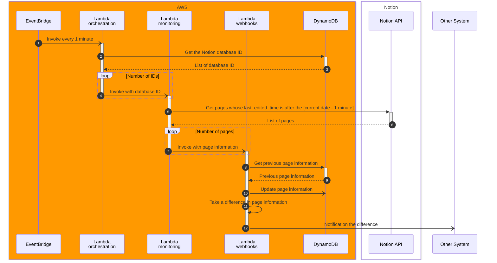

# Design notes

## Data definition

The data is managed in DynamoDB.

- [Database ID](#database-id)
- [Page information](#page-information)


### Database ID

| No. | name | description |
| --- | ---- | ----------- |
| 1   | user_id(PK) | User's email address |
| 2   | database_id(SK) | ID of Database in Notion |
| 3   | webhooks_url | Set of URL of the notification destination system |


### Page information

| No. | name | description |
| --- | ---- | ----------- |
| 1   | id(PK)| Page ID |
| 2   | last_edited_time | The datetime when the page was updated |
| 3   | page_info | [Page][notion-api-1] object(JSON string) |

`page_info` is the individual [Page][notion-api-1] object acquired in [Notion API (Query A database)][notion-api-2].
It is JSON String like the following.
```json
{
    "object": "page",
    "id": "59833787-2cf9-4fdf-8782-e53db20768a5",
    "created_time": "2022-03-01T19:05:00.000Z",
    "last_edited_time": "2022-07-06T20:25:00.000Z",
    ...
}
```


## Sequence




## Interface

### EventBridge --> Lambda(orchestration)

```json
{
    "user_id": "user@example.com"
}
```

### Lambda(orchestration) --> Lambda(monitoring)

Send the database ID and the URL (multiple) to notify the change by JSON.

For example...
```json
{
    "database_id": "15f6f80f6b294d55b04a32fc0f6a0fff",
    "webhooks_url": [
        "https://www.example.com"
    ]
}
```

### Lambda(monitoring) --> Lambda(webhooks)

The `event` object sent from Lambda (monitoring) to Lambda (webhooks) is `webhooks_url` and the [Page][notion-api-1] object([Page Information](#page-information)).

For example...
```json
{
    "webhooks_url": [
        "https://www.example.com"
    ],
    "page_info": {
        "object": "page",
        "id": "59833787-2cf9-4fdf-8782-e53db20768a5",
        "created_time": "2022-03-01T19:05:00.000Z",
        "last_edited_time": "2022-07-06T20:25:00.000Z",
        ...
    }
}
```


### Lambda(webhooks) --> Other System

The POST data sent from Lambda (webhooks) to Other System is as follows.

| No. | name | description |
| --- | ---- | ----------- |
| 1   | id   | Page ID     |
| 2   | last_edited_time | The datetime when the page was updated |
| 3   | added | Properties added to the database |
| 4   | changed | The part where there was a difference in the page |
| 5   | deleted | Properties deleted from the database |

No.3 to 5 is part of [Page][notion-api-1] objects.

For example...
```json
{
    "id": "59833787-2cf9-4fdf-8782-e53db20768a5",
    "last_edited_time": "2022-07-06T20:25:00.000Z",
    "added": {
        "properties": {
            "Due date": {
                "id": "M%3BBw",
                "type": "date",
                "date": {
                    "start": "2023-02-23",
                    "end": null,
                    "time_zone": null
                }
            }
        }
    },
    "changed": {
        "old": {
            "icon": {
                "type": "emoji",
                "emoji": "🐞"
            },
            "properties": {
                "Due date": {
                    "date": {
                        "start": "2023-01-23",
                        "end": null,
                        "time_zone": null
                    }
                }
            }
        },
        "new": {
            "icon": {
                "type": "emoji",
                "emoji": "🕷"
            },
            "properties": {
                "Due date": {
                    "date": {
                        "start": "2023-02-23",
                        "end": null,
                        "time_zone": null
                    }
                }
            }
        }
    },
    "deleted": {
        "Status": {
            "id": "Z%3ClH",
            "type": "status",
            "status": {
                "id": "86ddb6ec-0627-47f8-800d-b65afd28be13",
                "name": "Not started",
                "color": "default"
            }
        }
    }
}
```


[notion-api-1]: https://developers.notion.com/reference/page
[notion-api-2]: https://developers.notion.com/reference/post-database-query
