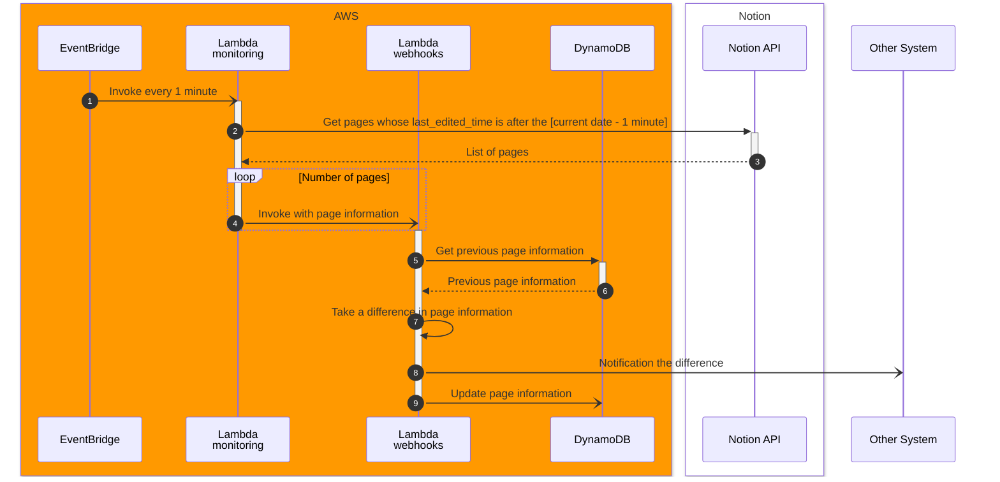

## Sequence

```mermaid
sequenceDiagram
    autonumber

    box rgb(255, 153, 0) AWS
    participant EB as EventBridge
    participant L1 as Lambda<br>monitoring
    participant L2 as Lambda<br>webhooks
    participant DynamoDB
    end
    box rgb(255, 255, 255) Notion
    participant Notion as Notion API
    end
    participant Other System

    EB -) L1: Invoke every 1 minute

    activate L1
    L1 ->>+ Notion: Get pages whose last_edited_time is after the [current date - 1 minute]
    Notion -->>- L1: List of pages

    loop Number of pages
        L1 -) L2: Invoke with page information
    end
    deactivate L1

    activate L2
    L2 ->>+ DynamoDB: Get previous page information
    DynamoDB -->>- L2: Previous page information
    L2 ->> L2: Take a difference in page information
    L2 -) Other System: Notification the difference
    L2 -) DynamoDB: Update page information
    deactivate L2
```